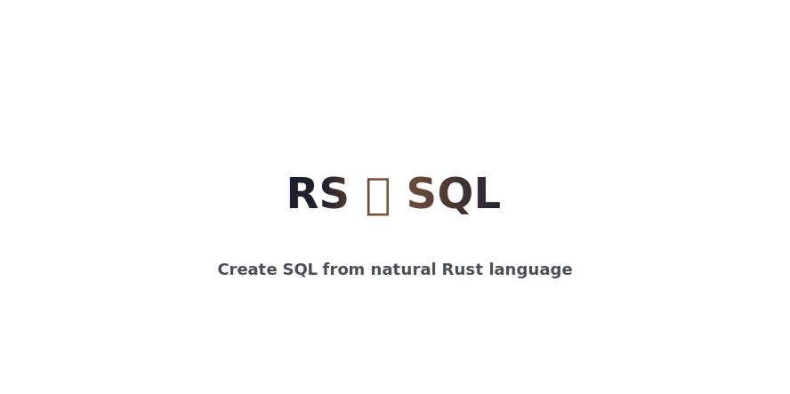

## ✨ Features ✨

`CrabQL` allows you to generate SQL queries that are
- 🌿 **Natural**:

  Write like Rust. No string parsing. Use proper composable types everywhere.
- 🚑 **Type Safe**:

  Query building is type-safe by construction; operations can only be generally used in correct contexts and internal representations are validated during a query's compilation.
- 📏 **Flat**:

  Traditionally nested queries can be created in a single chained expression.
- 📋 **Schema Validated**:

  Schemas can be used to additionally validate every table/column access and operations alongside with any other state-reliant operation.  
- 🤝 **Transactionally Safe**:

  Queries that depend on each other can only be generated as a single multi-query. This ensures any required ordering when executing the queries.

## 🚧 CAUTION: W.I.P.
- `CrabQL` is still in very early stages of production. There is still much work to do in the foundational back-end. Come back in a couple weeks/months to see what was implemented!
- The [`wiki`](https://github.com/aritmos/crabql/wiki) contains examples of the currently proposed API / crate use. 
- This project will eventually be published as a crate upon completing all core functionality in `0.2.0`.

## 📚 Use

The core of the library is a query builder that can creates the SQL queries.
The current (partially implemented) use case is as follows:

```rust
let query = {
    let checker: ExprChecker::from_schema("schema.sql").unwrap();
    let reader: Reader = Reader::new(&mut checker);
    
    reader
        .table("marketing")
        .new_col("category", { 
            case!{                
                col("created_date").lt(Date::new("2020-04-01")) => "pre-pandemic",
                col("created_date").lt(Date::new("2024-01-01")) => "last year",
                _ => "recent",
            } 
        }) 
        .filter(col("category").neq("old") & col("completed"))
        .save_as("cost_by_month", {
            let month = col("created_date").to_char("YYYY-MM"); 
            multi![
                col("campaign_id").as("campaign"),
                month,
                col("cost").sum().as("monthly_cost")
            ]
        })
        .table("cost_by_month")
        .group_by("campaign") 
        .order_by("campaign")
        .select(() << col("campaign") << col("monthly_cost").avg().as("avg cost"))
        .unwrap()
        .to_sql()
});

println!("{}", query);
```
outputs

```sql
WITH cost_by_month AS (
    SELECT
        campaign_id                      AS campaign,
        TO_CHAR(created_date, 'YYYY-MM') AS created_date,
        SUM(cost)                        AS total_cost
    FROM (
        SELECT *,
            CASE
                WHEN created_date < DATE '2020-04-01' THEN 'pre-pandemic'
                WHEN created_date < DATE '2024-01-01' THEN 'last year'
                ELSE 'recent' END AS category
        FROM marketing
    ) x
    WHERE category != 'pre-pandemic' AND completed = TRUE
)

SELECT campaign, AVG(total_cost) AS 'avg cost'
FROM cost_by_month
GROUP BY campaign
ORDER BY campaign
```

`CrabQL` is built with different SQL flavours in mind, and plans to eventually support all major dialects. However during it's early stages the focus will be on generating PostgreSQL-compliant queries, as that is what I personally use.

### 🌿 Natural

One of the core values of `CrabQL` is that of writing _natural_ Rust code. 
In particular this means discarding the common use of **string expression parsing**
as seen in similar crates, e.g.

```rust
selection
    .where("version > 12 AND is_stable")
    .select("'v' + str(version) + '_x86_64-linux'")
```

`CrabQL` uses proper types that can be composed via natural methods along with the overloading of common binary operators such as `BitAnd`/`BitOr`/`Neg` for logical `AND`/`OR`/`NOT` operations, as well as all the common arithmetic operators. Sadly the nature of Rust's type system doesn't allow for the specific overloading of comparison operators that is required, and these operations are left as methods.

```rust
selection
    .where(col("version").gt(12) & col("is_stable"))
    .select_one("v" + col("version") + "_x86_64-linux")
```

A type system like this, unlike string parsing, allows for the use of variables, comments and spacing to write clearer, more understandable expressions. It also allows one to call functions, APIs or any other endpoint to get necessary data. As an example, the following (100% real I-saw-it-in-production-last-week) expression is exteremly ill-suited for string parsing:

```sql
SELECT *
FROM employees
WHERE (salary > 100_000 OR department = 'Engineering')
  AND (start_date >= '2023-01-01' AND start_date < '2024-01-01')
  AND (age BETWEEN 25 AND 35 AND status = 'Active')
  AND (city IN ('New York', 'San Francisco', 'Seattle') OR manager_id IS NOT NULL)
  AND (NOT (position = 'Manager' AND (department = 'HR' OR department = 'Finance')))
  AND (EXISTS (SELECT 1 FROM performance_reviews WHERE employee_id = employees.id AND rating > 4))
  AND (NOT EXISTS (SELECT 1 FROM disciplinary_actions WHERE employee_id = employees.id))
```

With `CrabQL` the expression takes on a simple and readable form

```rust
reader.table("employees").filter({
    const HIGH_SALARY = 100_000;
    let high_salary_engineers = col("salary").gt(HIGH_SALARY) & col("department").eq("Engineering"); 
    let active_and_young = col("age").between(25, 35) & col("status").eq("Active");
    let big_office = col("city").in(external_api.get_main_offices())
    let is_manager = !col("manager_id").is_null();
    ...

    high_salary_engineers & ... & (big_office | is_manager) & ...
})
```

### 🚑 Safe

#### Type Safety 
One of the benefits of foregoing string-parsing is gaining the type-safety that rust can provide.
- The user doesn't have to double check that there are no missing quotation marks or brackets in a complex statement. 
- Operations such as `AND` can only be used on boolean expressions, and similarly for all other overloaded operators.
- Methods such as `.len()` (mapping to a `LENGTH()` statement) are only implemented for textual expression, and so forth.

#### State Safety
The other core safety-related feature, is that `CrabQL` **guarantees query correctness within the query's compilation**.
- This is done by providing the query builder the a copy database's schema. As the query is built, every statement gets checked for correctness: does this table exist? is this column numeric? etc. 
- Users may opt out of using the existing database's schema (internally called a `CompiledSchema`) and instead use a `DerivedSchema`, which builds itself upon use.
  - A `DerivedSchema` checks for the self-consistency of a query. It keeps track of how tables and columns are used to find the inner types of objects.
  - It then validates that there is no erroneous use such as a column being treated as containing text at one point, but numbers in another.

```rust
let mut checker = DerivedChecker::new(); // internally uses a `DerivedSchema`

// The checker infers that the <likes> column is numeric.
let view1 = Reader::new(&mut checker)
    .table("post_likes")
    .select(() << col("post_id") << (col("likes") + 1)) 
    .unwrap();

// The checker will throw an error when sealing the query because <likes> column is numeric but string concatenation requires a string.
let view2 = Reader::new(&mut checker)
    .table("post_likes")
    .select(() << col("post_id") << (col("likes") + "text")) 
```

Although the error is imediately found when an expression is used in a method, in order to allow for better type ergonomics, it is not exposed to the user until the entire query is sealed (finished)

#### Ordering Safety

Both the `CompiledSchema` and `DerivedSchema` update themselves to include any internal views or table modifications that the user defines. Self-consistency is a great feature to have in long read-write operations where the database's internal state is bound to change. `CrabQL` aims to implement a locking mechanism to ensure that any cases that depend on a specific query-ordering can only procude SQL queries that guarantee this ordering. 

For example a user might create a query that defines a new column within a table, and a subsequent query might write values into that new column. The aim is to ensure that these two queries can only be parsed as a single combined SQL query ensuring their necessary order. 

```rust
// TODO: API is still too-underdeveloped to showcase how the locking mechanism works
//       In particular how queries should be grouped before creating the complete SQL.
//       (Imagine the implementation yourself if you want)
```

## 🤨 Why??

All of this talk about types, and state checking, manipulation and safety seems like quite a lot of complexity for what tends to be a generally straightforward task. Is it really worth it? Yes ... maybe ... no ... who knows.

It is likely that the large majority of projects that manipulate databases through an application boundary keep their queries nice and small. In many cases it might simply suffice to use a simpler string-parsing library.

However when thinking about all of the possible implementations of a Rust-to-SQL library this version with extensive use of Rust features in the style of Rust's safety guarantees quickly became my favourite. A transpiler like this is vastly interesting to just think about how to handle the internal representations and logic, and it's complexity is something I'm hoping to push me into learning more and writing better Rust.


<div align="right">
  <a href="https://notbyai.fyi/">
  
  </a>
</div>
