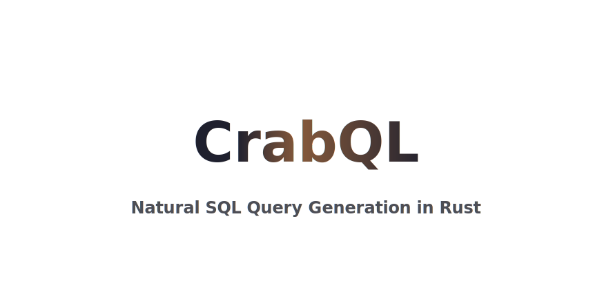

<div align="right">
  <a href="https://notbyai.fyi/">
  
  </a>
</div>

---

## 🚧 CAUTION

- This project is in such early stages that it doesn't even qualify to be a member of reality.
- It's always great to work with source control, and I might as well make it public for people to gander if they so please.
- In the case that the project takes off, I will likely end up publishing it on [`crates.io`](https://crates.io/).

## ✨ Focus and Goals

`rs->sql`(or `rs2sql`) is an ambitious project to "rustify the SQL language", stemming from a thought of how database querying would have been implemented by the Rust team. This project by no means attempts to be a complete reimagining of the SQL language; it simply tries to port the SQL syntax into a natural and friendly functional Rust code.

The core of the library is a query builder that can output `String`s of SQL.
As an experimental draft I have something like this in mind:

```rust
let query = {
    let monthly_cost = {
        // the schema is used to check for correctness in identifiers and operatations
        let schema: CompiledSchema = Schema::from_file("schema.sql").unwrap(); 
        let monthly_cost = schema
            .table("Marketing")
            .filter(|t| {
                let created_date = t["created_date"];
                let time_now = now();
                (time_now - Interval::new(3, TimeUnit::Month)).lt(created_date) & created_date.lt(time_now)    
            })
            .order_by([1, 2]) // generic functions that take care of casting
            .group_by([1, 2]) // 
            .select(|view| {
                let month = to_char(view["created_date"], "YYYY-MM");
                vec![
                    view["campaign_id"].as("campaign"),
                    month,
                    sum(view["cost"]).as("monthly_cost")
                ]
            })
            .as("Cost_By_Month")
    };

    monthly_cost
        .group_by("campaign") // generic functions that take care of casting
        .order_by("campaign") // 
        .select(|v| {
            vec![v["campaign"], avg(v["monthly_cost"]).as("Avg Monthly Cost")]
        })
        .to_sql()
});

println!("{}", query);
```
outputting
```sql
SELECT campaign, avg(monthly_cost) as "Avg Monthly Cost"
FROM
    (SELECT campaign_id AS campaign,
       TO_CHAR(created_date, 'YYYY-MM') AS month,
       SUM(cost) AS monthly_cost
    FROM marketing
    WHERE created_date BETWEEN NOW() - INTERVAL '3 MONTH' AND NOW()
    GROUP BY 1, 2
    ORDER BY 1, 2) as Cost_By_Month
GROUP BY campaign
ORDER BY campaign
```

### 🌿 Natural?

One of the core values of `rs2sql` is that of it providing _natural_ Rust code. In particular this means **no string expression parsing**. Other crates providing a Rust to SQL translation often use an API like:

```rust
selection.where("version > 12").select("'v' + str(version) + '_x86_64-linux'")
```

With internal logic parsing the expression encoded into the string. I don't like this and I don't want it. Instead `rs2sql` makes use of Rust's associated type parameters allowing the "overloading" of common operations to return new types which encode the action. These are then packaged inside of closures providing access into the query builder's state. Sadly the only case where this pattern cannot be implemented is ordering and equality, which require the use of methods:

```rust
selection.where(|t| t["version"].gt(12)).select(|t| "v" + t["version"] + "_x86_64-linux")
```

The ability to write your query's expressions as normal rust code means complex queries remain easy to write and read. Imagine writing the following `WHERE` clause within the string-parsing Rust-to-SQL crates:

```sql
SELECT *
FROM employees
WHERE (salary > 100_000 OR department = 'Engineering')
  AND (start_date >= '2023-01-01' AND start_date < '2024-01-01')
  AND (age BETWEEN 25 AND 35 AND status = 'Active')
  AND (city IN ('New York', 'San Francisco', 'Seattle') OR manager_id IS NOT NULL)
  AND (NOT (position = 'Manager' AND (department = 'HR' OR department = 'Finance')))
  AND (EXISTS (SELECT 1 FROM performance_reviews WHERE employee_id = employees.id AND rating > 4))
  AND (NOT EXISTS (SELECT 1 FROM disciplinary_actions WHERE employee_id = employees.id))
```

... at that point you might as well write the entire query into a string. Users can alternatively break up the filter into subqueries, which can work as long as the logic is decoupled but does fragment the flow of the query's creation. On the other hand with `rs2sql` we can write the whole thing within a single block, making use of variables, comments, and logic-segmentation as we please:

```rust
schema.read().table("employees").filter(|t| {
    let high_salary = 100_000;
    let high_salary_engineers = t["salary"].gt(high_salary) & t["department"].eq("Engineering"); 
    let active_and_young = t["age"].between(25, 35) & t["status"].eq("Active");
    let big_office = t["city"].in(external_api.get_main_offices)
    let is_manager = t["manager_id"].is_null();
    ...

    high_salary_engineers & ... & (big_office | !is_manager) & ...
})
```

### 🚑 Safe

#### Type Safety 
One of the benefits of foregoing string-parsing is gaining the type-safety that rust can provide. The user doesn't have to double check that there are no missing quotation marks or brackets in a complex statement.

#### State Safety
The other core safety-related feature, is that `rs2sql` **guarantees query correctness at the query's build time**. This is done by feeding the query builder the databases schema. As the query is built, every statement gets checked for correctness: does this table exist? is this column numeric? etc. Users may opt out of using a pre-fetched database schema (internally called a `CompiledSchema`) and instead use a `DerivedSchema`.

A `DerivedSchema` starts as a blank slate, and doesn't require any information about the database. As queries are created using this object, it keeps track of the accesses that are made, the operations on columns, etc. The `DerivedSchema` guarantees that any queries are simply self-consistent (this is also done implicitly with a `CompiledSchema`). So if one query uses `employees.id` as a string, another can't be using it as an integer.

```rust
let schema = Schema::derive(); // schema is built along with the operations that use it
// all of the following accesses are added into the schema. any clashes would result in an error
let view1 = schema.table["post_likes"].select(|t| vec![t["post_id"], t["likes"] + 1]) // `likes` is now enforced to be numeric
let view2 = view.select(|v| vec![v["post_id"], v["likes"] + "text"]) // this would fail because you cant add a numeric and a string
```

#### Ordering Safety

Both the `CompiledSchema` and `DerivedSchema` update themselves to include any internal views or table modifications that the user defines. Self-consistency is a great feature to have in long read-write operations where the database's internal state is bound to change. `rs2sql` aims to implement a locking mechanism to ensure that any cases that depend on a specific query-ordering can only procude SQL queries that guarantee this ordering. 

For example a user might create a query that defines a new column within a table, and a subsequent query might write values into that new column. The aim is to ensure that these two queries can only be finaly parsed into an SQL `String` together, in their necessary order. If this werent the case, and the user could separately create the queries, there is no guarantee that they will be called within the database in the right order!

```rust
// TODO: API is still too-underdeveloped to showcase how the locking mechanism works
//       In particular how queries should be grouped before creating the complete SQL.
//       (Imagine the implementation yourself if you want)
```

## 🤨 Why??

All of this talk about types, and state checking, manipulation and safety seems like quite a lot of complexity for what tends to be a straightforward task. Is it really worth it? Probably no.

I assume that the large majority of projects that manipulate databases through an application boundary keep their queries nice and small. In many cases it might simply suffice to use string interpolation to write the SQL query if one wants to use variables or logic.

However when thinking about all of the possible implementations of a Rust-to-SQL library this version with extensive use of Rust features in the style of Rust's safety guarantees quickly became my favourite. As a project it is vastly interesting to simply think about how to structure the internal representations and logic, and its complexity is something I'm hoping to push me into learning more and writing better Rust code.
